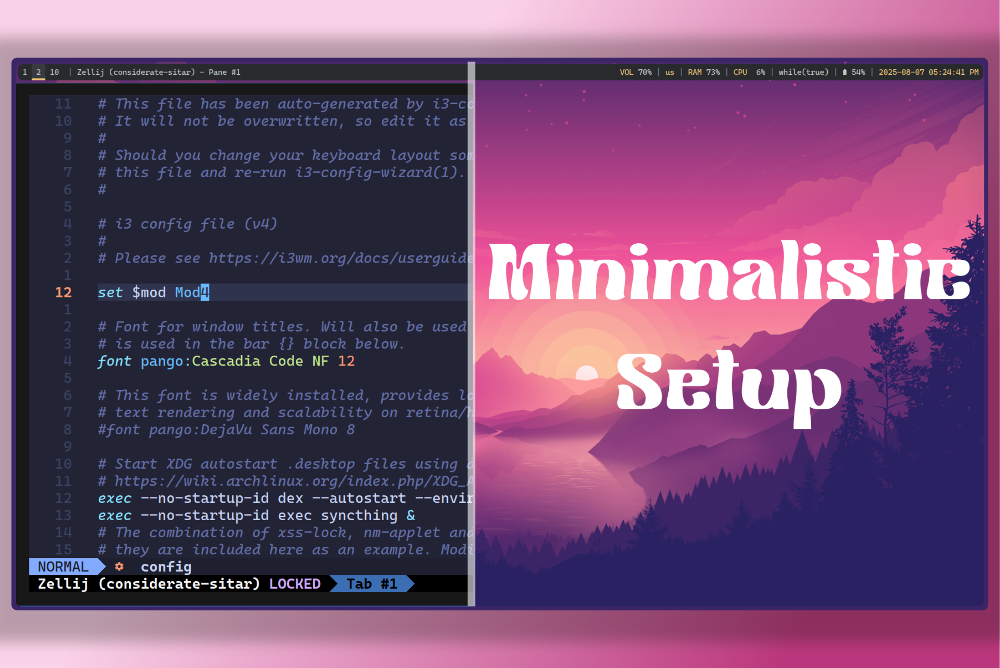

This is the documentation of config for i3wm setup.

> [!TIP]
> This is the minimalist linux steup, which increases your productivity. And it's fun to use btw.

## Explore


  
  


## Documentation

For more information, visit [Hextra](https://imfing.github.io/hextra).
